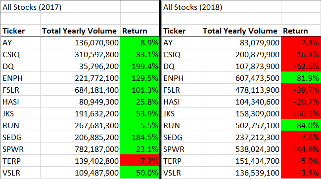
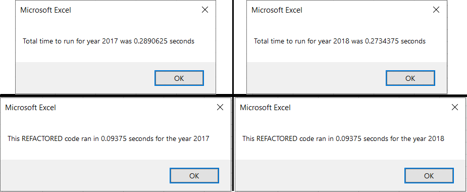
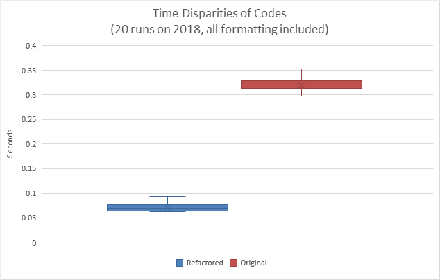

# VBA Challenge

## Project Overview

### Background

In the module, we explored how Excel was able to make short work of Steve's data for the green stocks. However, if Steve wants to analyze the entire market instead of just 12 stocks, we may have to re-think the efficiency of the code (which is to say nothing of the memory required to store the array of tickers). For each ticker we want to analyze (we have `N` of them), we have about 250 trading days to read, which means our nested-for loop code, running through every line of data for every ticker, runs in \~`O(250N`<sup>`2`</sup>`)` time. Modern computers can make this feel fast for small datasets, but larger datasets (of which "the entire market" certainly belongs to) quickly become unmanageable. 

### Time to Refactor

The process of going back to restructure your code is called *refactoring*; the goal is not to change *what* the code does but, rather, focus on *how* the code works by checking the underlying logic. One reason to refactor code is to make it more general, such could be the case for when we don't know *a priori* what the tickers we want to analyze are. Another reason to refactor code is to make the code more efficient, whether for memory usage or run time. As per the above, our goal here is to make our code more time efficient for running on large datasets.

#### Idea: Decrease Data Read Time

As noted above, our current code runs through every line of data for every ticker. But, if each ticker  has \~250 associated lines of data, are we needlessly running through `250 x (N-1)` lines of data for each ticker? Our code currently contains the logic to check if the next row of data is not the data we want; indeed, it is how we get the year-end closing price for the ticker (included in image below, unhighlighted). If we added a `break` statement after this, we won't read the next lines of useless-to-this-ticker data. 

Such an idea works well to cut down on the amount of data read for the first few iterations of our for loops. However, since we still start each inner loop from the first row of data, when we get to the latter tickers in our ticker array, the code will still run through lots of data to get to our target data. On average, then, this will cut down on reading through half the data for each ticker, giving us a run time of around `O(125N`<sup>`2`</sup>`)`; an improvement, but not a significant one.

If we can break out of the inner for loop early, it follows that starting the inner loop further down in the data would decrease data read times even further. Such an idea would require reassigning the data's first row variable, used in the control of the inner for loop, just before the `break` statement. Thus, in theory, we would only read each ticker's associated 250 lines of data, for a run time nearing `O(250N)`, a very marked improvement over `O(250N`<sup>`2`</sup>`)` at high-`N`. An example of what this code might look like is below, with the relevant lines of code highlighted.  


#### Idea: Refine the ticker control

By the logic used to loop through the ticker array and start into, and break out of, the data for loop, we **require absolutely** that the tickers array list the tickers in the same order the tickers appear in the dataset. An error in this vein can break the results and miss analyses ranging from just one ticker to nearly all the tickers. The outer for loop is solely for ticker control; that is, if we find another way to keep track of our tickers, we can eliminate the outer for loop and avoid this potential analysis-breaking error. Furthermore, we can eliminate the computing time required to loop through the ticker array, though this may be minimal compared to the actual reading of the data.

To accomplish that goal, we abstract the ticker array control from a for loop to the `tickerIndex` counter. Rather than changing the focus of the ticker array with the for loop, we increment `tickerIndex` at the logic point noted above in which we test if the following dataset ticker is different from the current one. Because we previously used the outer, ticker control for loop to write the output analysis data, we instead now create arrays to store this information; the indices are maintained in step with the tickers array via the same `tickerIndex` variable.

The refactored code utilizing `tickerIndex` is shown below; the array declarations remain the same as before and writing data output is handled similarly, but unshown here for space. Because we only have one for loop to read the entirety of the data, the code should run in about `O(250N)` time. For running the macro on Steve's larger datasets, it is beneficial it only runs in linear time rather than quadratic time. Though we sacrifice a little memory for the new output arrays, we save lots of computing time by only looping through the dataset once.  


(Note on the aforementioned potential for bugs: The goal of this challenge was to refactor the code created throughout the module. To that end, the challenge provided some skeletal structure, which included the declaration and initialization of the tickers array, rather than recreate all of the code from step 0. Because the tickers array is already populated and this is a narrowly scoped example, we allow our logic tests and array outputs require absolutely that the tickers array be populated in the same order the tickers appear in the dataset. It is possible to write this code tickers order-agnostic: by (1) populating the tickers array as we move through the dataset and (2) changing the logic to be compared to the next datum rather than the tickers array, we could generalize the code to work without *a priori* knowledge of the tickers.) 


## Results

### Stock Discussion

Green energy stocks as a sector performed much better in 2017 than 2018. The average return in 2017 was +67.3\%, with 4 stocks more than doubling in price and only one negative with a modest loss of -7.2\%. This is a stark contrast to 2018, in which only two stocks were positive for an average return of -8.5\%. The two outperformers in 2018 did so with yearly returns above +80\% for the year, though the two greatest losses of the year were just under -60\%. Both years saw total yearly volumes over 3.1 billion units for the green energy sector, with a modest \<5\% increase in 2018 over 2017. The above can be seen in the results table below.  



### Runtime Discussion

Below is a composite image of the runtimes displayed for the original and refactored codes after running on the 2017 and 2018 datasets each. As is evident, the runtimes for the refactored code are faster.  



For a more rigorous discussion on the code execution times, we can run the macros numerous times to get an average runtime. To do this, we make a few modifications of the codes and run them per the following:
* We run the original and refactored macros on only the 2018 dataset (hard-coded in); this was done to eliminate human input time biases in the input box (the year 2018 was arbitrary). 
* Formatting code was included in the original macro code to match the refactored code. 
* Control of the analysis macro was achieved via new subroutines with for loops that, in sequential order, 
    1) started a built-in `Timer` instance, 
    2) called the analysis macro, 
    3) ended the started `Timer` instance, 
    4) populated an array of runtimes, and 
    5) wrote the array of runtimes to a range of empty cells. 
* Each analysis macro was run 20 times (not a large number, but enough for our purposes). 
* Minimal background tasks were running (but not absent) during the tests.
* The original macro and refactored macro tests were conducted successively.

The results of the runtime tests are summarised in the following table (all numbers in seconds) and Box-and-Whiskers plot:  
```
               Refactored Macro     Original Macro
Average time        0.071                0.318
Median              0.070                0.313
St. Dev.            0.008                0.014
```  


The refactored code improved the average runtime efficiency by over a factor of 4! Furthermore, there is less variability in the refactored code, though this could easily be attributable to the background tasks on the computer using CPU resources. With the small datasets Steve provided us for green stocks, a time difference of a quarter second is hardly noticeable, quite literally a blink of the eye. However, the linear vs quadratic runtime would grow ever more apparent on datasets as large as the entire market (as is Steve's ambition), potentially being the difference between a runtime of 1 day and 1 week.

## Summary

As noted throughout the preceding discussion, there are numerous advantages to refactoring code. One of the most common advantages is producing code that runs a lot quicker, as specifically highlighted in the VBA macro challenge above. Code can also be refactored to be more memory efficient: while not specifically noted previously, the price information of the tickers for this VBA challenge were stored as the `Single` dataype, which takes up half the memory as the `Double` datatype, which is the "typical" datatype I have used for decimal numbers. While this would be of little effect for our purposes, complex and long code projects do have to be conscientious of memory usage.

Also noted above was the idea of refactoring code to be more general. Steve presented us with a dataset *and* a list of the tickers contained in the dataset, giving us *a priori* knowledge for our array making. Some minor tweaks (specifically populating the tickers array as we loop through the dataset) would enable us to provide analyses to Steve's friends and their different datasets as well.

Further, some code refactoring becomes a necessity due to changing standards of a programming language. For example, the Python language had numerous syntax changes when it started migrating to version 3.1 from version 2.7, such as `print("Hello World!")` replacing `print "Hello World!"`. To make sure code continued to work after the change was completed, it would obviously need to be refactored (some people even created `Future` and `Past` modules that could be imported to help ease the transition and refactoring process).

Unfortunately, there's no free lunch and there are disadvantages to refactoring code as well. Most notably, it takes time and, therefore, money to refactor code. The pertinent question to ask becomes: will the time/money invested to refactor the code pay for itself? In the example of Python code no longer working after the version upgrade, the obvious answer would be yes. In the example of our VBA code, which took a few hours to refactor, it was likely not worth it to save a measely 0.25 seconds in runtime (though this does discount the pedagogical benefits).

What compounds the issue of the time it takes to refactor the code is another issue of simply not understanding the logic of the refactor. Our given job in this challenge was not to simply refactor code, it was to refactor the code using just one for loop and the `tickerIndex`. At the beginning of the project, this made absolutely no sense to me and, indeed, confused many of my colleagues. Had the assignment been simply to refactor the code, my stopping point likely would have been the train of logic presented above in [decreasing the data read time](#idea:-decrease-data-read-time). It wasn't until I'd finished writing the code in its entirety that the benefits of the assigned logic clicked and I was in agreement with the method. Afterall, though, that would be one of the benefits to taking this bootcamp -- exposing myself to new ways of tackling challenges -- wouldn't it?
